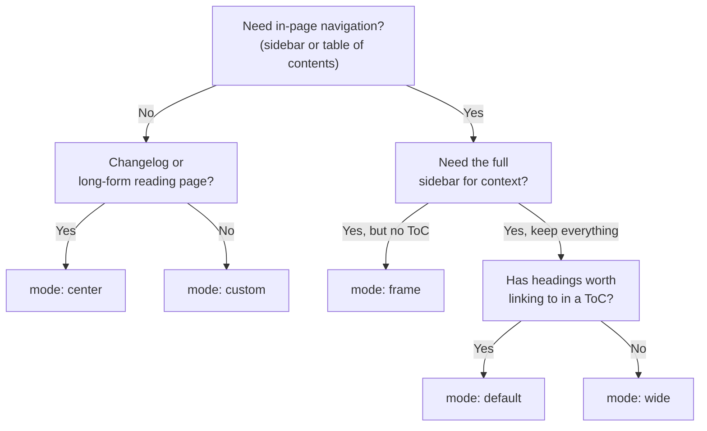

<div className="bp2-scope max-w-6xl mx-auto px-6">

<div className="bp2-progress-track">
  <div className="bp2-progress-bar" data-bp2-progress-bar />
</div>

<div className="flex items-center justify-between py-6 text-sm">
  <a href="/" className="flex items-center gap-2 text-gray-500 dark:text-zinc-400 hover:text-gray-900 dark:hover:text-zinc-100 transition-colors">
    <Icon icon="arrow-left" />
    Back to docs
  </a>
  <Badge color="blue" icon="sparkles" shape="pill">Design guide · v2.0</Badge>
</div>

<div className="bp2-hero bp2-spotlight bp2-fade-up relative rounded-3xl px-8 py-28 md:py-40 text-center bg-gradient-to-br from-blue-950 via-blue-700 to-blue-600">
  <div className="bp2-hero-glow-a" />
  <div className="bp2-hero-glow-b" />
  <div className="bp2-hero-glow-c" />
  <div className="relative z-10 flex flex-col items-center">
    <h1 className="bp2-display bp2-gradient-text text-6xl md:text-7xl lg:text-8xl max-w-4xl">
      Best Practices 2.0
    </h1>
    <p className="mt-8 text-blue-100 text-lg md:text-xl max-w-xl">
      Everything below is a real, working Mintlify page — built with page modes,
      Tailwind classes, and the component library, instead of inline styles fighting
      the theme.
    </p>
    <div className="mt-10 flex flex-wrap items-center justify-center gap-4">
      <a href="#component-gallery" className="inline-flex items-center gap-2 rounded-full bg-white text-blue-700 font-semibold px-6 py-3 text-sm hover:-translate-y-0.5 active:scale-95 transition-transform">
        Explore the components ↓
      </a>
      <a href="https://mintlify.com/docs/guides/custom-layouts" target="_blank" rel="noreferrer" className="inline-flex items-center gap-2 rounded-full border border-white/40 text-white font-semibold px-6 py-3 text-sm hover:bg-white/10 active:scale-95 transition-all">
        Read the official guide
      </a>
    </div>
  </div>
</div>

<div className="bp2-section-nav -mx-6 px-6 mt-10 mb-10 rounded-b-2xl">
  <div className="max-w-6xl mx-auto flex flex-wrap items-center justify-center gap-2 py-3">
    <a href="#page-modes" data-bp2-nav-target="page-modes" className="bp2-nav-pill rounded-full px-4 py-1.5 text-sm font-medium text-gray-600 dark:text-zinc-300">Page modes</a>
    <a href="#component-gallery" data-bp2-nav-target="component-gallery" className="bp2-nav-pill rounded-full px-4 py-1.5 text-sm font-medium text-gray-600 dark:text-zinc-300">Components</a>
    <a href="#build" data-bp2-nav-target="build" className="bp2-nav-pill rounded-full px-4 py-1.5 text-sm font-medium text-gray-600 dark:text-zinc-300">Build</a>
    <a href="#motion" data-bp2-nav-target="motion" className="bp2-nav-pill rounded-full px-4 py-1.5 text-sm font-medium text-gray-600 dark:text-zinc-300">Motion</a>
    <a href="#limitations" data-bp2-nav-target="limitations" className="bp2-nav-pill rounded-full px-4 py-1.5 text-sm font-medium text-gray-600 dark:text-zinc-300">Limitations</a>
  </div>
</div>

<div className="bp2-marquee-viewport overflow-hidden py-2 mb-16 border-y border-gray-100 dark:border-zinc-800">
  <div className="bp2-marquee-track gap-8 text-sm font-medium text-gray-400 dark:text-zinc-500 whitespace-nowrap pr-8">
    <span>Tabs</span><span>·</span><span>CodeGroup</span><span>·</span><span>Steps</span><span>·</span><span>Callouts</span><span>·</span><span>Badge</span><span>·</span><span>Tooltip</span><span>·</span><span>Card</span><span>·</span><span>Columns</span><span>·</span><span>Tile</span><span>·</span><span>Color</span><span>·</span><span>Tree</span><span>·</span><span>Mermaid</span><span>·</span><span>Update</span><span>·</span><span>Prompt</span><span>·</span><span>Accordion</span><span>·</span>
    <span>Tabs</span><span>·</span><span>CodeGroup</span><span>·</span><span>Steps</span><span>·</span><span>Callouts</span><span>·</span><span>Badge</span><span>·</span><span>Tooltip</span><span>·</span><span>Card</span><span>·</span><span>Columns</span><span>·</span><span>Tile</span><span>·</span><span>Color</span><span>·</span><span>Tree</span><span>·</span><span>Mermaid</span><span>·</span><span>Update</span><span>·</span><span>Prompt</span><span>·</span><span>Accordion</span><span>·</span>
  </div>
</div>

<Tip>
  **What changed from v1.** The first showcase page (see [Almedia Link — Showcase](/almedia-link-showcase))
  used the default page mode plus inline `style={{...}}` props everywhere. That fought Mintlify's own
  prose styling and caused a heading-alignment bug that kept coming back no matter how it was patched.
  This page fixes the actual cause: `mode: "custom"` for a blank canvas, Tailwind classes (with `dark:`
  variants) instead of inline styles, and a small scoped CSS file only for what Tailwind genuinely can't do.
</Tip>

<div className="grid grid-cols-2 md:grid-cols-4 gap-4 my-16 text-center">
  <div>
    <div className="bp2-display bp2-count text-4xl md:text-5xl text-blue-700 dark:text-blue-400" data-bp2-count="28">28</div>
    <div className="mt-2 text-sm text-gray-500 dark:text-zinc-400">distinct component tags used</div>
  </div>
  <div>
    <div className="bp2-display bp2-count text-4xl md:text-5xl text-blue-700 dark:text-blue-400" data-bp2-count="5">5</div>
    <div className="mt-2 text-sm text-gray-500 dark:text-zinc-400">page modes covered</div>
  </div>
  <div>
    <div className="bp2-display bp2-count text-4xl md:text-5xl text-blue-700 dark:text-blue-400" data-bp2-count="0">0</div>
    <div className="mt-2 text-sm text-gray-500 dark:text-zinc-400">layout style props used</div>
  </div>
  <div>
    <div className="bp2-display bp2-count text-4xl md:text-5xl text-blue-700 dark:text-blue-400" data-bp2-count="1">1</div>
    <div className="mt-2 text-sm text-gray-500 dark:text-zinc-400">interactive mode explorer, 0 lines of JS</div>
  </div>
</div>

<h2 id="page-modes" className="bp2-display text-3xl md:text-4xl text-gray-900 dark:text-zinc-50 text-center mt-20">
  Five page modes, one frontmatter field
</h2>
<p className="mt-4 text-gray-500 dark:text-zinc-400 text-center max-w-2xl mx-auto">
  Set `mode` in a page's frontmatter to control which chrome Mintlify renders around your content.
  This page uses `custom` — no sidebar, no table of contents, no footer nav — just the top navbar and
  a blank canvas.
</p>

<CardGroup cols={3}>
  <Card title="default" icon="table-columns">
    Sidebar, table of contents, and footer nav all render. The standard doc page — what every other
    page on this site uses.
  </Card>
  <Card title="wide" icon="arrows-left-right">
    Keeps the sidebar and footer, drops the table of contents. Good for pages without headings, or
    ones that need the extra horizontal room.
  </Card>
  <Card title="custom" icon="expand">
    Strips everything except the top navbar. A blank canvas for landing pages — this is that mode,
    right now.
  </Card>
  <Card title="frame" icon="crop">
    Keeps the sidebar for navigation, drops the table of contents and modifies the footer. Only
    supported on the Aspen, Almond, Luma, and Sequoia themes.
  </Card>
  <Card title="center" icon="align-center">
    Drops the sidebar and table of contents, keeps the footer. Built for changelogs and focused
    reading. Only supported on Mint, Linden, Willow, and Maple.
  </Card>
</CardGroup>

<div className="bp2-spotlight-card bp2-mode-explorer mt-8 rounded-2xl border border-gray-200 dark:border-zinc-800 p-6 md:p-8">
  <p className="relative z-10 text-center text-sm font-medium text-gray-500 dark:text-zinc-400 mb-4">
    Click a mode to see what it keeps and drops — pure CSS, no JavaScript involved
  </p>

  <input type="radio" name="bp2-mode" id="bp2-mode-default" className="sr-only" defaultChecked />
  <input type="radio" name="bp2-mode" id="bp2-mode-wide" className="sr-only" />
  <input type="radio" name="bp2-mode" id="bp2-mode-custom" className="sr-only" />
  <input type="radio" name="bp2-mode" id="bp2-mode-frame" className="sr-only" />
  <input type="radio" name="bp2-mode" id="bp2-mode-center" className="sr-only" />

  <div className="bp2-mode-labels relative z-10 flex flex-wrap items-center justify-center gap-2">
    <label htmlFor="bp2-mode-default" className="bp2-mode-label rounded-full px-4 py-1.5 text-sm font-semibold bg-gray-100 dark:bg-zinc-800 text-gray-700 dark:text-zinc-200 cursor-pointer">default</label>
    <label htmlFor="bp2-mode-wide" className="bp2-mode-label rounded-full px-4 py-1.5 text-sm font-semibold bg-gray-100 dark:bg-zinc-800 text-gray-700 dark:text-zinc-200 cursor-pointer">wide</label>
    <label htmlFor="bp2-mode-custom" className="bp2-mode-label rounded-full px-4 py-1.5 text-sm font-semibold bg-gray-100 dark:bg-zinc-800 text-gray-700 dark:text-zinc-200 cursor-pointer">custom</label>
    <label htmlFor="bp2-mode-frame" className="bp2-mode-label rounded-full px-4 py-1.5 text-sm font-semibold bg-gray-100 dark:bg-zinc-800 text-gray-700 dark:text-zinc-200 cursor-pointer">frame</label>
    <label htmlFor="bp2-mode-center" className="bp2-mode-label rounded-full px-4 py-1.5 text-sm font-semibold bg-gray-100 dark:bg-zinc-800 text-gray-700 dark:text-zinc-200 cursor-pointer">center</label>
  </div>

  <div className="bp2-mode-panels relative z-10 mt-6 max-w-lg mx-auto">
    <div data-for="default">
      <div className="flex h-14 gap-1 rounded-xl overflow-hidden">
        <div className="w-1/6 bg-slate-700 dark:bg-slate-600" />
        <div className="flex-1 bg-blue-600/25" />
        <div className="w-1/5 bg-slate-300 dark:bg-slate-500" />
      </div>
      <p className="mt-4 text-center text-sm text-gray-500 dark:text-zinc-400">
        Sidebar + content + table of contents. The standard doc page, all chrome present.
      </p>
    </div>
    <div data-for="wide">
      <div className="flex h-14 gap-1 rounded-xl overflow-hidden">
        <div className="w-1/6 bg-slate-700 dark:bg-slate-600" />
        <div className="flex-1 bg-blue-600/25" />
      </div>
      <p className="mt-4 text-center text-sm text-gray-500 dark:text-zinc-400">
        Sidebar + content, no table of contents. More room for pages without headings.
      </p>
    </div>
    <div data-for="custom">
      <div className="flex h-14 gap-1 rounded-xl overflow-hidden">
        <div className="flex-1 bg-blue-600/25" />
      </div>
      <p className="mt-4 text-center text-sm text-gray-500 dark:text-zinc-400">
        Just content. A blank canvas — this page. Only the top navbar remains.
      </p>
    </div>
    <div data-for="frame">
      <div className="flex h-14 gap-1 rounded-xl overflow-hidden">
        <div className="w-1/6 bg-slate-700 dark:bg-slate-600" />
        <div className="flex-1 bg-blue-600/25" />
      </div>
      <p className="mt-4 text-center text-sm text-gray-500 dark:text-zinc-400">
        Sidebar + content, modified footer. Aspen, Almond, Luma, and Sequoia themes only.
      </p>
    </div>
    <div data-for="center">
      <div className="flex h-14 gap-1 rounded-xl overflow-hidden">
        <div className="w-1/6 bg-transparent" />
        <div className="flex-1 bg-blue-600/25" />
        <div className="w-1/6 bg-transparent" />
      </div>
      <p className="mt-4 text-center text-sm text-gray-500 dark:text-zinc-400">
        Centered content, footer kept. Built for changelogs. Mint, Linden, Willow, and Maple only.
      </p>
    </div>
  </div>
</div>



<h2 id="component-gallery" className="bp2-display text-3xl md:text-4xl text-gray-900 dark:text-zinc-50 text-center mt-24">
  The component library, live
</h2>
<p className="mt-4 text-gray-500 dark:text-zinc-400 text-center max-w-2xl mx-auto">
  Every element below is a real Mintlify component rendering on this actual page — not a screenshot.
</p>

<Tabs>
  <Tab title="Structure">
    <p className="text-gray-600 dark:text-zinc-300">
      `Tabs`, `CodeGroup`, and `Columns` are the workhorses for organizing content side by side.
    </p>
    <CodeGroup>
      ```js index.js
      import { Link } from "@almedia/link-sdk";

      const link = new Link({
        container: "#link-root",
        theme: "midnight",
      });

      link.render();
      ```

      ```swift LinkViewController.swift
      import AlmediaLink

      let link = LinkView(theme: .midnight)
      view.addSubview(link)
      link.render()
      ```

      ```kotlin MainActivity.kt
      val link = LinkView(context, theme = LinkTheme.MIDNIGHT)
      container.addView(link)
      link.render()
      ```
    </CodeGroup>
  </Tab>

  <Tab title="Emphasize">
    <div className="grid gap-3">
      <Note>Notes call out neutral, useful context.</Note>
      <Tip>Tips suggest a better way to do something.</Tip>
      <Info>Info draws attention without implying risk.</Info>
      <Warning>Warnings flag something to watch out for.</Warning>
      <Check>Checks confirm a completed or valid state.</Check>
      <Danger>Danger callouts are for real risk — use sparingly.</Danger>
      <Callout icon="palette" color="#0021F3">
        The generic `Callout` takes any hex color and icon — this one uses Lead Blue.
      </Callout>
    </div>
    <div className="mt-6 flex flex-wrap gap-2">
      <Badge color="blue" icon="star">Featured</Badge>
      <Badge color="green" icon="circle-check" stroke>Shipped</Badge>
      <Badge color="orange" icon="clock" size="sm">In progress</Badge>
      <Badge color="purple" shape="pill" size="lg">Design system</Badge>
      <Badge color="gray" icon="lock" disabled>Locked</Badge>
    </div>
    <p className="mt-6 text-gray-600 dark:text-zinc-300">
      Hover a term for context, like <Tooltip headline="ELK" tip="Eclipse Layout Kernel — a layout engine Mintlify's Mermaid diagrams can use for large graphs." cta="See Mermaid docs" href="https://mintlify.com/docs/components/mermaid-diagrams">ELK layout</Tooltip>, without leaving the page.
    </p>
  </Tab>

  <Tab title="Navigate">
    <CardGroup cols={2}>
      <Card title="Quickstart" icon="rocket" href="/quickstart">
        The project's actual quickstart page.
      </Card>
      <Card title="Introduction" icon="house" href="/">
        Back to the docs home.
      </Card>
      <Card title="Showcase v1" icon="clock-rotate-left" href="/almedia-link-showcase">
        The earlier page this one improves on.
      </Card>
      <Card title="Custom layouts guide" icon="book-open" href="https://mintlify.com/docs/guides/custom-layouts">
        The official Mintlify guide this page follows.
      </Card>
    </CardGroup>

    <div className="mt-6">
      <Columns cols={3}>
        <Tile href="https://mintlify.com/docs/components/cards" title="Cards & Columns" description="Link out, group content">
          <div className="flex h-full items-center justify-center gap-1 bg-blue-50 dark:bg-blue-950">
            <div className="h-10 w-8 rounded bg-blue-600/70" />
            <div className="h-10 w-8 rounded bg-blue-600/40" />
            <div className="h-10 w-8 rounded bg-blue-600/20" />
          </div>
        </Tile>
        <Tile href="https://mintlify.com/docs/components/tabs" title="Tabs & code groups" description="Switch between views">
          <div className="flex h-full flex-col items-center justify-center gap-1 bg-blue-50 dark:bg-blue-950">
            <div className="h-2 w-16 rounded-full bg-blue-600/60" />
            <div className="h-6 w-20 rounded bg-blue-600/20" />
          </div>
        </Tile>
        <Tile href="https://mintlify.com/docs/components/tree" title="Tree & steps" description="Show structure and order">
          <div className="flex h-full flex-col items-center justify-center gap-1 bg-blue-50 dark:bg-blue-950">
            <div className="h-1.5 w-6 self-start ml-6 rounded-full bg-blue-600/60" />
            <div className="h-1.5 w-10 self-start ml-10 rounded-full bg-blue-600/40" />
            <div className="h-1.5 w-8 self-start ml-14 rounded-full bg-blue-600/25" />
          </div>
        </Tile>
      </Columns>
    </div>
  </Tab>

  <Tab title="Visualize">
    <p className="text-gray-600 dark:text-zinc-300 mb-4">
      Brand palette, with light/dark-aware values where the color itself needs to change per theme:
    </p>
    <Color variant="compact">
      <Color.Item name="Lead Blue" value="#0021F3" />
      <Color.Item name="Midnight" value="#0D2A4C" />
      <Color.Item name="Cream" value="#F1EFEA" />
      <Color.Item name="surface" value={{ light: "#FFFFFF", dark: "#0B1220" }} />
    </Color>

    <p className="text-gray-600 dark:text-zinc-300 mt-6 mb-4">
      This repository's actual file structure, as a `Tree`:
    </p>
    <Tree>
      <Tree.File name="docs.json" />
      <Tree.File name="index.mdx" />
      <Tree.File name="quickstart.mdx" />
      <Tree.File name="almedia-link-showcase.mdx" />
      <Tree.File name="best-practices-2.mdx" highlight />
      <Tree.File name="best-practices-2.css" highlight />
      <Tree.File name="scroll-animations.js" />
    </Tree>

    <p className="text-gray-600 dark:text-zinc-300 mt-6 mb-4">
      And a live card for the framework this whole site runs on:
    </p>
    <GitHub.Repo repo="mintlify/docs" />
  </Tab>

  <Tab title="Ship">
    <Update label="v2.0" description="Best Practices 2.0" tags={["design", "mintlify"]}>
      Rebuilt the showcase page with `mode: "custom"`, Tailwind classes, and real dark-mode support —
      no more inline styles fighting the theme.
    </Update>

    <p className="text-gray-600 dark:text-zinc-300 mt-8 mb-4">
      A reusable prompt for building the next page this way:
    </p>
    <Prompt description="Build a Mintlify custom-mode landing page the recommended way." icon="wand-magic-sparkles" actions={["copy"]}>
      Build a Mintlify documentation page using `mode: "custom"` frontmatter. Style every element with
      Tailwind utility classes and `dark:` variants — never the `style` prop, since inline styles can
      cause a layout shift on load and don't track Mintlify's dark-mode toggle. Only add a dedicated,
      class-prefixed CSS file for values Tailwind's utilities genuinely can't express (custom keyframe
      animation, exact-pixel decorative positioning). Use real Mintlify components — Cards, Tabs,
      Callouts, Steps, Accordions — instead of hand-rolled divs wherever one exists.
    </Prompt>
  </Tab>
</Tabs>

<h2 id="build" className="bp2-display text-3xl md:text-4xl text-gray-900 dark:text-zinc-50 text-center mt-24">
  Building a hero the recommended way
</h2>

<Steps>
  <Step title="Choose the page mode first">
    Set `mode: "custom"` in frontmatter before writing a single line of layout. It decides whether you're
    working inside the standard doc chrome or on a blank canvas — retrofitting it later means redoing
    every alignment assumption.
  </Step>
  <Step title="Reach for Tailwind classes, not the style prop">
    `className="text-center max-w-3xl mx-auto"` instead of `style={{textAlign: 'center', ...}}`. Tailwind
    classes are applied before hydration; inline styles can cause a visible layout shift, and they don't
    respond to Mintlify's dark-mode toggle the way `dark:` classes do.
  </Step>
  <Step title="Drop to a scoped CSS file for the rest">
    Keyframe animation and exact-pixel decorative positioning aren't things Tailwind's utilities cover.
    Put them in a `.css` file, prefix every class (`.bp2-...` here) since Mintlify applies CSS site-wide
    with no per-page scoping.
  </Step>
  <Step title="Add dark mode as you go, not after">
    Every `dark:` variant in this page was written next to its light-mode class, not bolted on at the
    end. Retrofitting dark mode across a whole page is where most of it gets missed.
  </Step>
  <Step title="Respect prefers-reduced-motion">
    Any custom CSS animation should turn itself off under `@media (prefers-reduced-motion: reduce)`.
    This page's hero glow does exactly that.
  </Step>
</Steps>

<h2 id="motion" className="bp2-display text-3xl md:text-4xl text-gray-900 dark:text-zinc-50 text-center mt-24">
  Motion that's already running
</h2>
<p className="mt-4 text-gray-500 dark:text-zinc-400 text-center max-w-2xl mx-auto">
  The mode explorer above needs zero JavaScript — five radio inputs and a handful of sibling-selector
  CSS rules in `best-practices-2.css` do the switching, so it works even with scripts fully disabled.
  Everything else in motion — the progress bar at the top, the sticky nav's active-section highlight, and
  the cursor-tracked glow on the hero and cards — is progressive enhancement from `best-practices-2.js`,
  plain DOM JavaScript with no React state (Mintlify MDX doesn't support hooks or imports). Each one
  degrades harmlessly if the script doesn't run: the bar stays empty, the pills still work as plain links,
  and the glow still appears on `:hover`, just without tracking the cursor.
</p>

<h2 id="limitations" className="bp2-display text-3xl md:text-4xl text-gray-900 dark:text-zinc-50 text-center mt-24">
  Limitations worth knowing
</h2>
<p className="mt-4 text-gray-500 dark:text-zinc-400 text-center max-w-2xl mx-auto">
  None of these are blockers — they're sharp edges that are cheap to avoid once you know they exist.
</p>

<AccordionGroup>
  <Accordion title="No Tailwind arbitrary values">
    Classes like `w-[350px]` or `bg-[#0021F3]` aren't supported. Anything Tailwind's standard scale can't
    express — an exact pixel value, an exact brand hex outside the theme's `colors.primary` — needs a
    small custom CSS class instead.
  </Accordion>
  <Accordion title="Custom CSS and JS are site-wide, not page-scoped">
    Any `.css` or `.js` file in the content directory is auto-included on every page — there's no CSS
    Modules-style isolation. Prefix every class name (this page uses `bp2-`) or you'll eventually collide
    with another page's styles.
  </Accordion>
  <Accordion title="mode: custom removes real navigation, not just chrome">
    Along with the sidebar and table of contents, `custom` mode drops the footer prev/next links and,
    per Mintlify's own docs, the `Panel` component stops rendering entirely. A page in this mode needs
    its own way back into the docs — the "Back to docs" link at the top of this page exists because of
    that.
  </Accordion>
  <Accordion title="frame and center modes are theme-gated">
    `frame` only renders on the Aspen, Almond, Luma, and Sequoia themes; `center` only on Mint, Linden,
    Willow, and Maple. Picking one without checking `docs.json`'s `theme` field first can mean it silently
    falls back to default behavior.
  </Accordion>
  <Accordion title="The style prop is fine for exact values — just not as a Tailwind substitute">
    Mintlify's own docs actually recommend `style` for one-off arbitrary values, like an exact image
    width, since arbitrary Tailwind classes aren't supported. The caution is specifically about using
    `style` in place of Tailwind classes for everyday layout — that's what risks a layout shift on load,
    and it's a dead end for dark mode since there's no `dark:` equivalent for a static `style` object.
    This page's one legitimate use of `style` is dynamic, not static: `best-practices-2.js` sets
    `--bp2-x`/`--bp2-y` CSS custom properties from real mousemove events for the cursor-glow effect —
    there's nothing for that to mismatch on hydration, since it only ever runs after a real user action.
  </Accordion>
  <Accordion title="A page's JS can't be scoped to that page, and load order isn't guaranteed">
    Every `.js` file in the content directory runs on every page, site-wide, with no way to limit it to
    one page — `best-practices-2.js` guards itself by checking for this page's `.bp2-scope` element before
    doing anything. If you ship more than one script file, Mintlify doesn't guarantee which runs first.
  </Accordion>
  <Accordion title="Custom JS didn't execute in local mint dev preview during testing">
    Testing this page against a real `mint dev` server, `best-practices-2.js` never loaded — no `<script>`
    tag for it, no network request for it, and even the site's pre-existing `scroll-animations.js` showed
    the same gap (zero `.scroll-reveal` elements ever appeared). Custom CSS *did* apply correctly in the
    same test. This is why the mode explorer above was deliberately rebuilt as pure CSS rather than left
    JS-driven, and why every other script-powered effect on this page (progress bar, active-nav highlight,
    cursor glow) is optional polish, not load-bearing. Re-verify custom JS specifically after deploying,
    rather than assuming Mintlify's documented site-wide auto-inclusion behaves the same in local preview.
  </Accordion>
  <Accordion title="Hand-written dark-mode CSS can drift from Mintlify's own toggle">
    Tailwind's `dark:` classes track Mintlify's actual dark-mode toggle. A `@media (prefers-color-scheme: dark)`
    rule in a custom CSS file only tracks the OS-level setting, so it can disagree with the toggle if a
    reader overrides their site theme manually. This page keeps its custom CSS to theme-independent
    decoration (the hero glow) specifically to avoid that mismatch.
  </Accordion>
  <Accordion title="No built-in motion system">
    Beyond Tailwind's `transition` and `hover:` utilities, Mintlify has no animation component. Real
    keyframe motion — like this page's drifting hero glow, or the site's scroll-reveal — has to be
    hand-rolled in custom CSS/JS, and has to remember `prefers-reduced-motion` itself since nothing
    does that for you.
  </Accordion>
</AccordionGroup>

<div className="bp2-hero bp2-spotlight relative rounded-3xl px-8 py-20 md:py-28 text-center bg-gradient-to-br from-blue-600 to-blue-950 mt-24 mb-8">
  <div className="bp2-hero-glow-a" />
  <div className="bp2-hero-glow-c" />
  <h2 className="bp2-display text-white text-3xl md:text-4xl max-w-xl mx-auto relative z-10">
    Read the source for both pages
  </h2>
  <p className="mt-4 text-blue-100 max-w-lg mx-auto relative z-10">
    Compare this page's MDX against the original showcase to see exactly what moved from inline styles
    to Tailwind and custom CSS.
  </p>
  <div className="mt-8 flex flex-wrap items-center justify-center gap-4 relative z-10">
    <a href="/almedia-link-showcase" className="inline-flex items-center gap-2 rounded-full bg-white text-blue-700 font-semibold px-6 py-3 text-sm hover:-translate-y-0.5 active:scale-95 transition-transform">
      View Showcase v1
    </a>
    <a href="https://mintlify.com/docs/guides/custom-layouts" target="_blank" rel="noreferrer" className="inline-flex items-center gap-2 rounded-full border border-white/40 text-white font-semibold px-6 py-3 text-sm hover:bg-white/10 active:scale-95 transition-all">
      Official Mintlify guide
    </a>
  </div>
</div>

</div>
